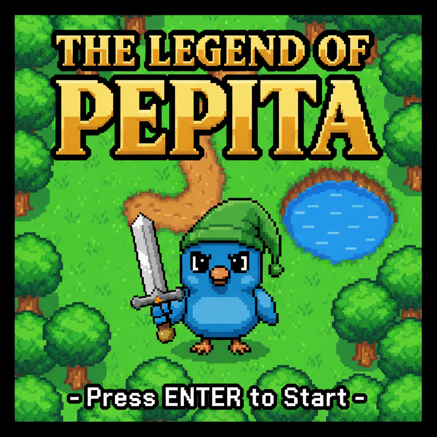
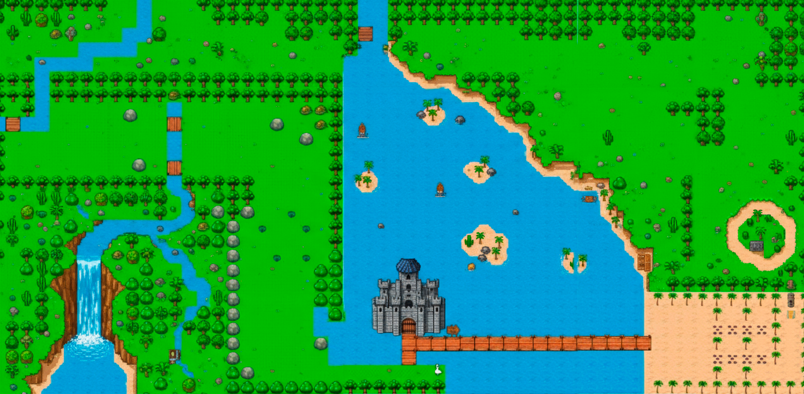
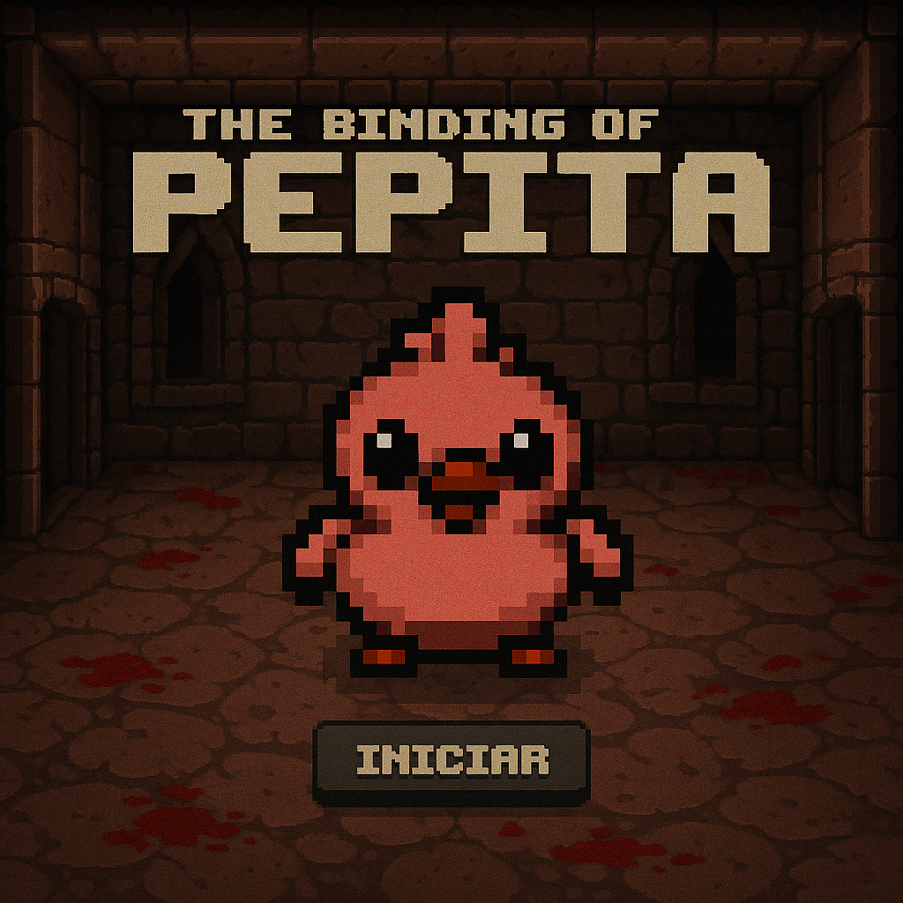

# Paradigma Objetos

Consigna: https://docs.google.com/document/d/12Gj_MrR9fLi926D66XO_tRvhrnWc4T2gjpfusKGZy0I/edit?tab=t.0#heading=h.wnm2lu4cls8j

## Integrantes

- Ivan Ales (iales)
- Federico Gaston Ales (FedericoAles)

---

# Objetivo del juego - The Legend of Pepita

Se trata de un juego inspirado en los clasicos de *"The Legend of Zelda"*, con estilo retro pixelado y colores muy vivos. En nuestra version tenemos al personaje principal **Pepito**, el cual debera atravesar una amplia variedad de escenarios y combatir varios enemigos en el camino para lograr su objetivo, salvar a **Pepita**, quien se encuentra en un castillo.  

  

---

# Instrucciones  

- Movimiento: WASD
- Iniciar juego: Enter
- Atacar: J
- Reinicar: R

---
# Mapa  

---

# Explicación teórica 

## **Clases, Objetos y Funciones**

Cada elemento del juego fue modelado como una clase u objeto con una responsabilidad única:

- **Pepito** representa al protagonista y gestiona su posición, dirección, vida y nivel.

- **Espada, Corazón y Llave** son objetos con comportamientos específicos: ataque, curación y apertura de puertas.

- **Los enemigos (como Slime, Cazador, Tiburón, Águila o Esqueleto)** administran su vida, velocidad, etc.

- **Castillo y Pato** son objetos inmóviles que pueden interactuar con Pepito y controlan sus propios estados y comportamientos (por ejemplo, abrirse o generar una llave).

- **La clase Nivel organiza** la disposición de obstáculos y enemigos, y los objetos *nivel1 a nivel10* heredan de ella, reutilizando su estructura base y delegando los principales métodos que permiten la generación de niveles.

De esta manera, **cada clase se ocupa exclusivamente de su propia lógica, delegando acciones a otros objetos cuando es necesario.**

 ## **Herencia**

La herencia se utilizó para **reutilizar código y establecer jerarquías** donde las subclases comparten comportamiento común pero pueden especializarse según sus necesidades.

**Jerarquía de Enemigos:**
- La clase **`Enemigo`** define el comportamiento base: gestión de vida, métodos `perderVida()`, `morir()`, `colisionarCon()` y detección de contacto. 
- Las subclases **`Slime`, `Cazador`, `Águila`, `Tiburón`, `Murcielago`, `Esqueleto` y `Gato`** heredan toda esta estructura, evitando duplicar código.
- Cada subclase personaliza lo necesario: el Slime se mueve aleatoriamente, el Cazador persigue a Pepito, el Esqueleto tiene dos fases, etc. Pero todos comparten la lógica de recibir daño y morir porque la heredan.

**Jerarquía de Niveles:**
- La clase **`Nivel`** encapsula la infraestructura para crear niveles: métodos para ubicar obstáculos, enemigos, trampas, limpiar el nivel y verificar transiciones.
- Los diez objetos de nivel (**`nivel1` a `nivel10`**) heredan esta estructura completa, por lo que solo necesitan definir las listas de posiciones específicas de sus elementos, delegando toda la lógica de creación a los métodos heredados.

**Ventaja:** Evita duplicación masiva de código. Sin herencia, cada enemigo o nivel tendría que reimplementar toda la lógica común, resultando en cientos de líneas repetidas.

## **Encapsulamiento**

El encapsulamiento **se aplicó para proteger el estado interno de cada entidad.**

 Por ejemplo, Pepito controla sus atributos **(vida, mirandoA, inmortal, entre otros)** solo mediante métodos como **moverA(), perderVida() o curarVida()**.
 
 De forma similar, **los enemigos gestionan su salud, daño y movimiento sin exponer directamente sus variables internas.**
El uso de **var y const** **permite definir qué atributos pueden modificarse** y cuáles deben permanecer inalterables (por ejemplo, **esPisable o haceDaño** están pensados para ser **constantes** y nunca alterados), garantizando un control coherente del estado interno y evitando errores externos.

## **Polimorfismo**

Todos los objetos del juego implementan el método **colisionarCon(elemento)**, pero cada uno responde de manera diferente según su tipo:

- **Corazon → cura a Pepito.**

- **Llave → abre el castillo.**

- **Espada → se equipa en Pepito y habilita el ataque.**

- **Pato → genera una llave al colisionar.**

- **Enemigos → reducen su vida o la del jugador, dependiendo si el objeto con el que colisionaron es un arma o no (esArma()).**

Esto representa *polimorfismo por comportamiento*, ya que **diferentes clases responden de forma particular a un mismo mensaje.**

 Gracias a esto, el motor del juego puede manejar cualquier objeto de manera genérica sin conocer sus detalles internos, lo que facilita la extensión y mantenimiento del sistema.

## **Colecciones**

El principal uso que le dimos a las colecciones es para designar las coordenadas de los obstáculos, enemigos y objetos de cada nivel. Nos permite tener una lista constante de la posición que va a tener cada cosa en un nivel determinado.

Por ejemplo:

 **const posicionesPiedras = [[5,25],[0,20],[0,15],[0,10],[0,5],[0,0]]**
  
 **const posicionesArbustos = [[35,10],[35,5],[35,0],[30,0],[30,5]]**

etc.

 ## **Enemigos**

El juego cuenta con una variedad de enemigos, cada uno con comportamiento único:

- **Slime:** Se mueve aleatoriamente por el mapa. Vida: 2 puntos.

- **Cazador:** Persigue activamente a Pepito en todo momento. Vida: 5 puntos.

- **Águila:** Movimiento aleatorio rápido con animación de vuelo. Vida: 1 punto.

- **Tiburón:** Alterna entre hundirse (mostrando solo la aleta) y emerger para atacar, moviéndose verticalmente. Vida: 6 puntos.

- **Murcielago:** Movimiento aleatorio con animación de aleteo constante. Vida: 3 puntos.

- **Esqueleto:** Persigue a Pepito con dos fases. Al ser derrotado la primera vez, se desmorona en huesos y tras 3 segundos se regenera más rápido y agresivo. Solo muere definitivamente en la segunda fase. Vida: 6 + 4 puntos.

- **Gato (Jefe Final):** Boss con múltiples fases y ataques especiales. Primera fase: genera lava en el suelo y dispara bolas de energía. Segunda fase: invoca gatitos como minions. Incluye diálogos antes de la batalla. Vida: 26 puntos.

---

# Trampas y Obstáculos

El juego incluye varios tipos de trampas que añaden dificultad:

- **Trampa de Pinchos:** Se activa y desactiva periódicamente causando daño.

- **Trampa de Fuego:** Similar a los pinchos pero con fuego.

- **Trampa de Oso:** Otra variante de trampa periódica.

- **Tótems con Flechas:** Disparan flechas automáticamente en dirección específica cuando se activan mediante placas de presión.

- **Obstáculos estáticos:** Árboles, piedras, arbustos y agua que bloquean el paso.

---

# Progresión del Juego

- **10 niveles únicos:** Cada uno con su propio diseño, enemigos y obstáculos específicos.

- **Sistema de puertas:** Algunas puertas se abren solo al derrotar todos los enemigos del nivel o al obtener la llave.

- **Objetos coleccionables:** Corazones para recuperar vida, la espada para atacar, y la llave para acceder al castillo final.

- **Mecánicas especiales:** 
  - Invulnerabilidad temporal tras recibir daño
  - Placas de presión que activan mecanismos
  - Jefe final con múltiples fases

---

# Diagrama Estático 
Este archivo contiene ambos diagramas estaticos, para hacer el primero nos basamos en el codigo de "pepito.wlk" y para el segundo en el de "enemigos.wlk". 

---

## Ideas de juegos

### The Legend of Pepita
Se trata de un juego inspirado en los clasicos de *"The Legend of Zelda"*, con estilo retro pixelado y colores muy vivos. En nuestra version tenemos al personaje principal **Pepito**, el cual debera atravesar una amplia variedad de escenarios y combatir varios enemigos en el camino para lograr su objetivo, salvar a **Pepita**, quien se encuentra en un castillo.  
Actualmente, el prototipo solo muestra un mapa plano basico con un solo tipo de enemigo de poca complejidad. Se espera agregar mas mapas, mas enemigos y mas mecanicas en general.  
Finalmente habra un castillo en donde se deberan superar varios desafios para llegar a completar el juego y salvar a Pepita.  

### The Binding of Pepita
 The Binding of Pepita es un roguelite de accion y aventura inspirado en The Binding of Isaac. Controlás a Pepita, un pajarito que debe atravesar habitaciones de una dungeon, derrotar enemigos y vencer a un jefe final para escapar. Ataca lanzando huevos que pueden mejorarse con power-ups. Cada sala propone movimiento, esquive y puntería en tiempo real. La partida termina si se vacía la vida o derrotas al jefe. 

### Survivor of the city 

El jugador controla a un sobreviviente atrapado en la ciudad gótica, debe moverse por el escenario evitando y enfrentando a distintas criaturas. Cada criatura tiene un comportamiento propio: algunas lo persiguen, otras se mueven al azar o se desplazan lentamente. El objetivo del juego es sobrevivir el mayor tiempo posible y sumar puntos al derrotar criaturas, mientras se incrementa la dificultad a medida que aparecen más enemigos. El juego termina cuando el sobreviviente  pierde todas sus vidas, mostrando en pantalla su puntaje. 

Está inspirado en típicos juegos de supervivencia como pacman y geometry dash.

